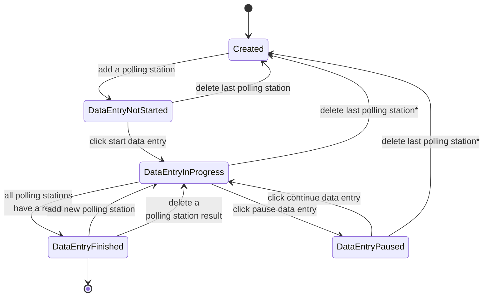

# Committee session state

This document describes the states a committee session can have.
The transition labels describe the action/situation that is used for performing the transition.

*currently it's only possible to delete polling stations that do not have a data entry,
deleting data entries and results needs to be implemented after which the polling station can be deleted
