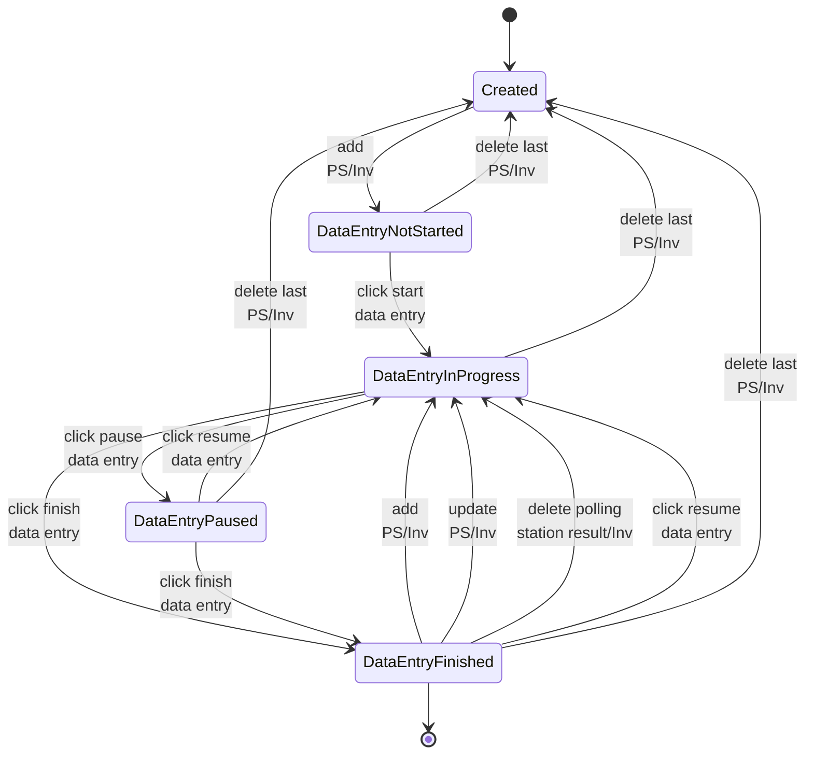

# Committee session state

This document describes the states a committee session can have.
The transition labels describe the action that is used for performing the transition.

The label "PS/Inv" on several transitions indicates a "polling station" for the first
committee session, and an "investigation" in any subsequent committee session.

