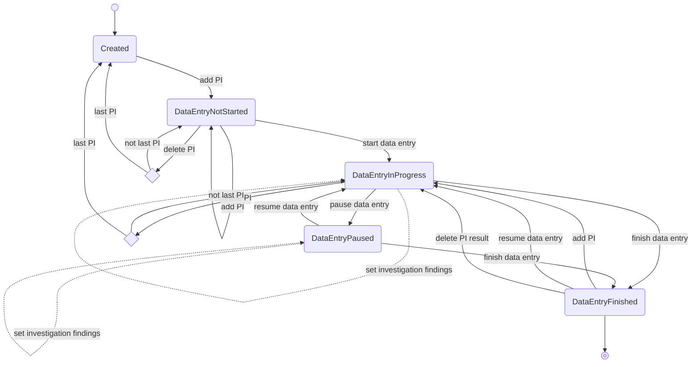

# Committee session state

This document describes the states a committee session can have.
The transition labels describe the action that is used for performing the transition.

The label PI on several transitions indicates a "polling station" for the first committee session, whereas this is an "investigation" in any subsequent committee session. The transitions with dotted lines for setting investigation findings do not occur in the first committee session.

*currently it's only possible to delete polling stations that do not have a data entry,
deleting data entries and results needs to be implemented (see https://github.com/kiesraad/abacus-internal/issues/296) 
after which the polling station can be deleted
