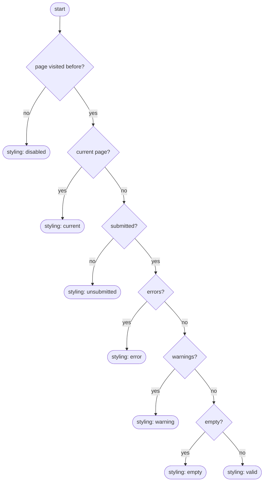
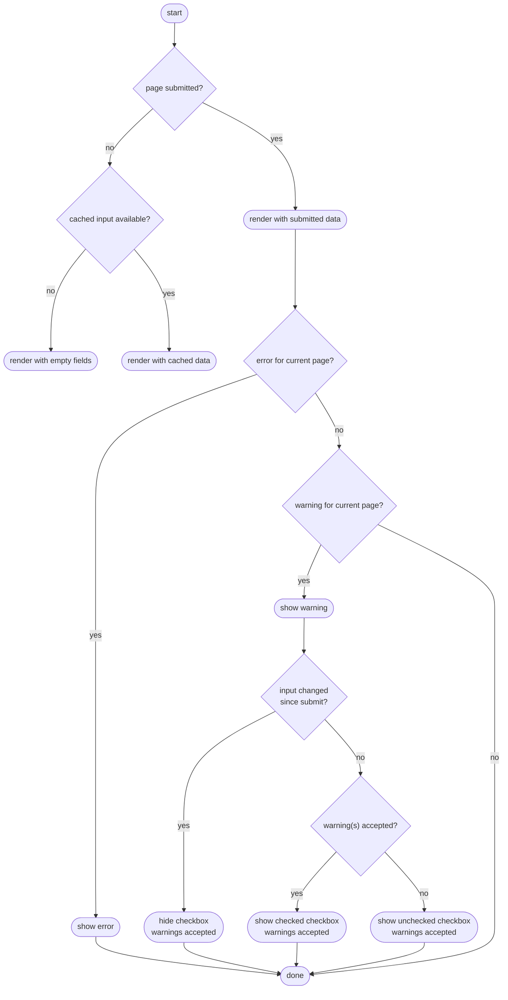
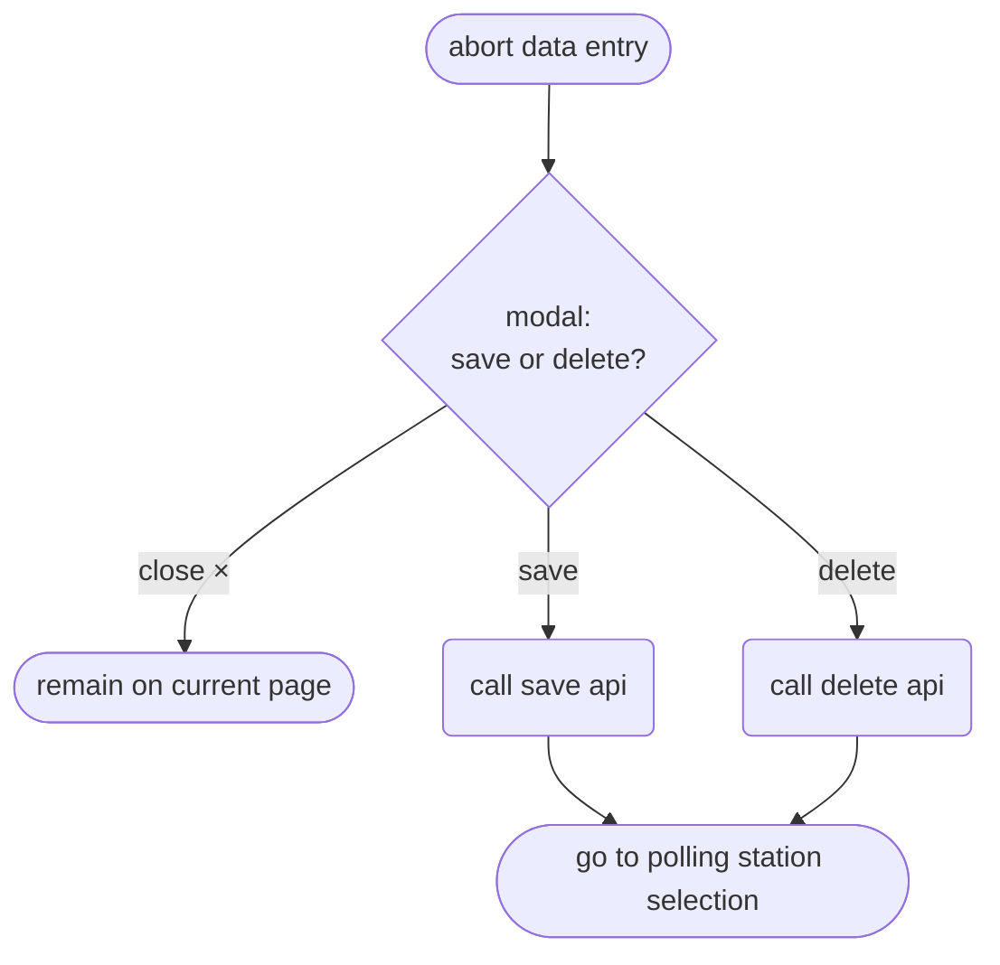

# Data Entry Forms

This page describes the navigation and rendering logic of the data entry forms through the following flow charts:

- __Render navigation menu__: styling of the different items in the left-hand navigation menu
- __Render form__: rendering of the different forms for data entry
- __Click "Volgende"__: what should happen when the user clicks the "Volgende" ("Next") button
- __Navigate away from page__: what should happen when the user navigates away from the page in any other way than clicking the "Volgende" button

An important thing to keep in mind when reading these diagrams is that a user can only proceed to the next form by clicking "Volgende" after they have resolved all errors (if any) and accepted all warnings (if any).

## Questions
- Where does "cache input" happen in these flows? After each keystroke?

## Render navigation menu

Render happens based on last received API response.

## Render form

Render happens based on last received API response.

## Click "Volgende"

- If there is a warning and the user changes the input, they should no longer have the option to accept the warning. They need to click "Next" first, to validate the changed input.
- Currently, only error F.204 can trigger on a previous page such that the user is redirected to that page.

## Navigate away from page

Navigating away from a page can happen in several ways:
- Clicking an item in the left navigation menu
- Clicking a link in an error or warning message
- Clicking a link in the top navigation bar
- Clicking the browser back/forward button

The next page can be either within the form or outside it. The action flow depends on this.

The abort button ("Invoer afbreken") is a special case covered in the next section. The rules in this flowchart do not apply to the abort button.

# Abort data entry ("Invoer afbreken")

