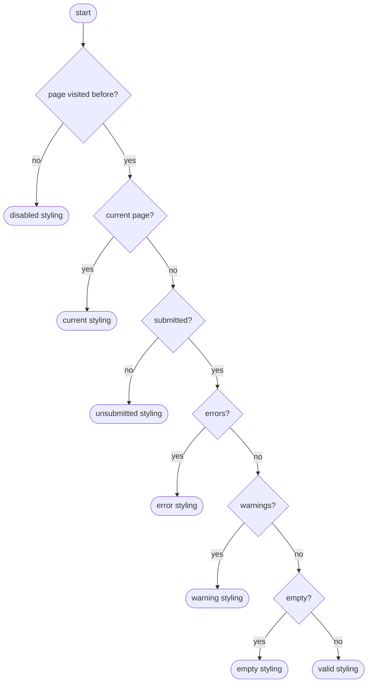
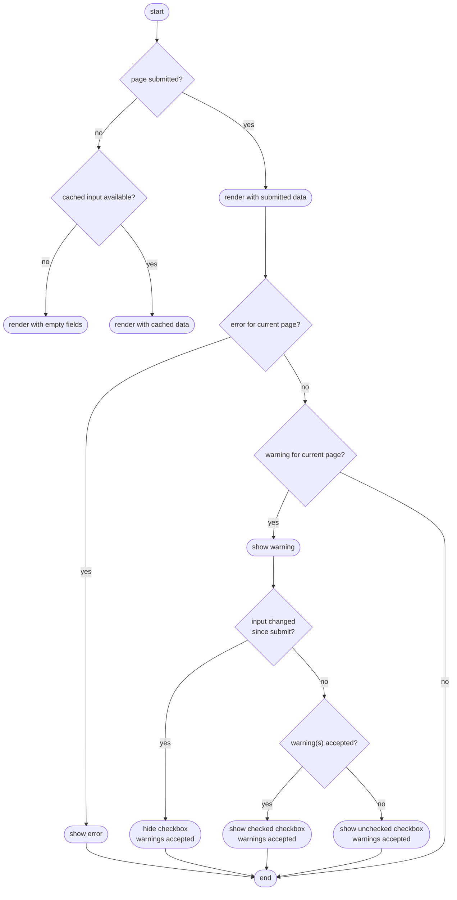
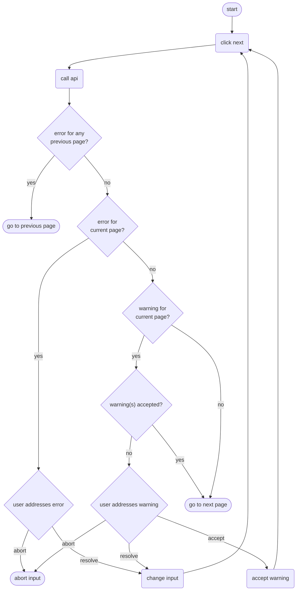
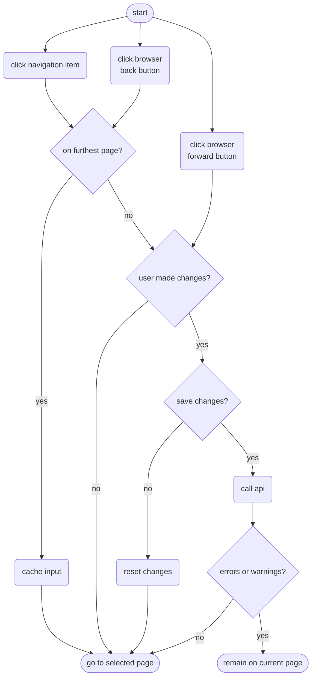

# Data Entry Forms

This page describes the navigation and rendering logic of the data entry forms.

An important thing to keep in mind when reading these diagrams is that a user can only move on to the next form after resolving all errors (if any) and accepting all warnings (if any). So it should not be possible that any form previous to the current one has any errors or unaccepted warnings.

## Questions
- Where does "cache input" happen in these flows? After each keystroke?

## Render navigation menu

Render happens based on last received API response.

## Render form

Render happens based on last received API response.

## Click "Volgende"

Note that if there is a warning and the user changes the input, they should no longer have the option to accept the warning. They need to click "Next" first, to validate the changed input.

## Click navigation item or browser back/forward buttons

