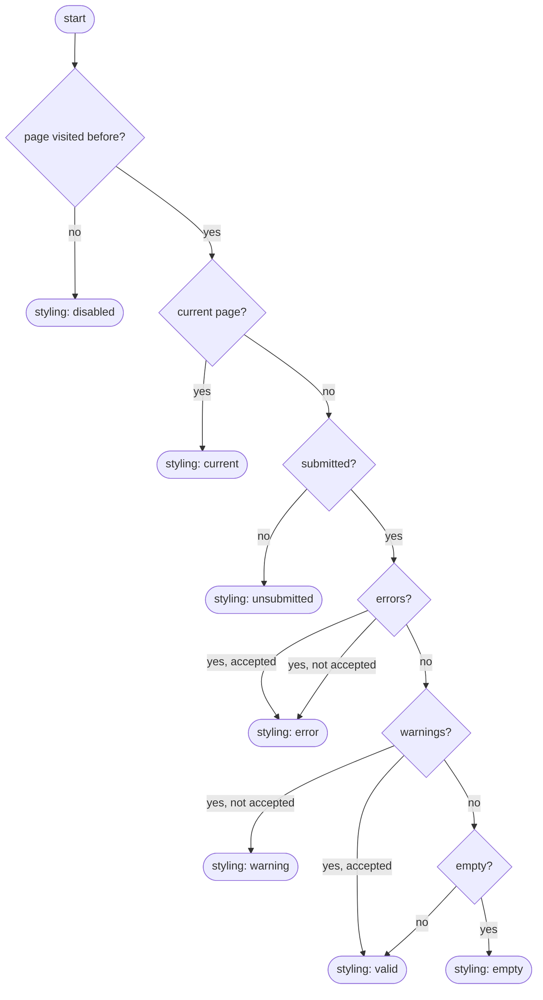
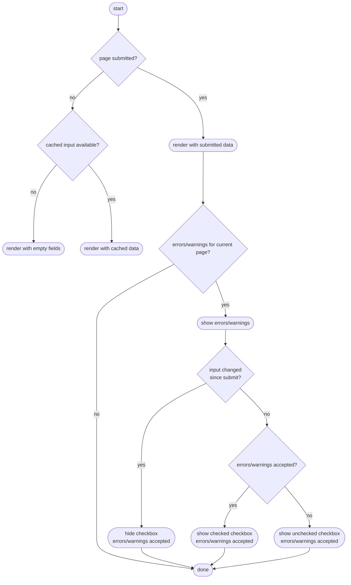
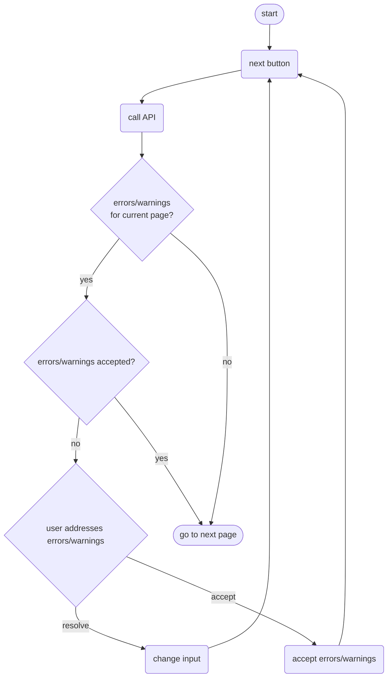
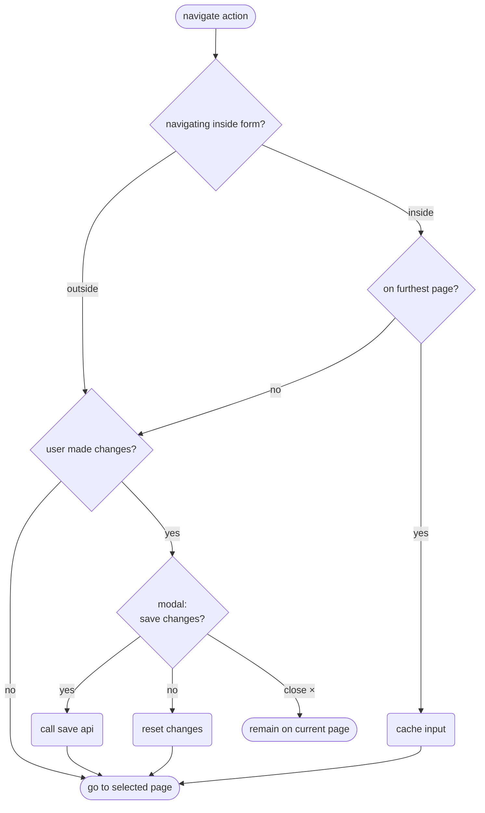
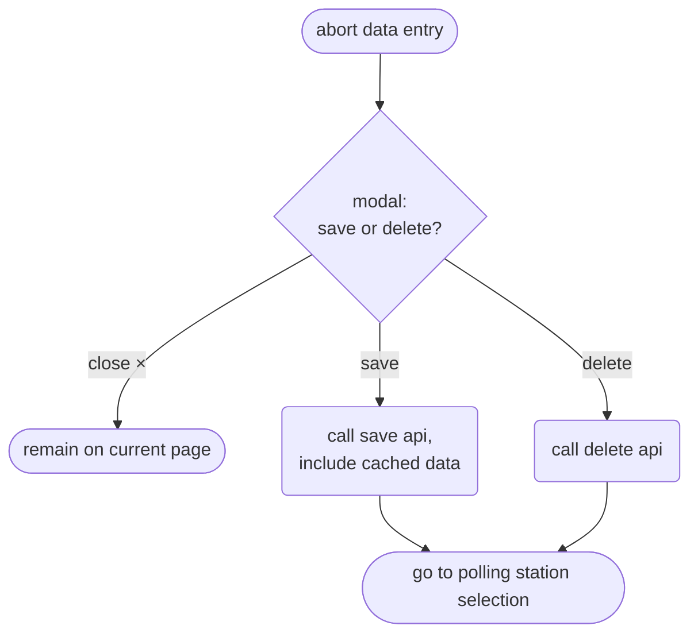

# Data Entry Forms

This page describes the navigation and rendering logic of the data entry forms through the following flow charts:

- [__Render navigation menu__](#render-navigation-menu): styling of the different items in the left-hand navigation menu
- [__Render form__](#render-form): rendering of the different forms for data entry
- [__Click "Volgende"__](#click-volgende): what should happen when the user clicks the "Volgende" ("Next") button
- [__Navigate away from page__](#navigate-away-from-page): what should happen when the user navigates away from the page in any other way than clicking the "Volgende" button
- [__Abort data entry ("Invoer afbreken")__](#abort-data-entry-invoer-afbreken): what should happen when the user clicks "Invoer afbreken" at the top of the screen

An important thing to keep in mind when reading these diagrams is that a user can only proceed to the next form by clicking "Volgende" after they have resolved or accepted all errors (if any) and warnings (if any).

## Render navigation menu

Render happens based on last received API response.

## Render form

Render happens based on last received API response.

## Click "Volgende"

- If there is a warning or error and the user changes the input, they should no longer have the option to accept the errors/warnings. They need to click "Next" first, to validate the changed input.

## Navigate away from page

Navigating away from a page can happen in several ways:
- Clicking an item in the left navigation menu
- Clicking a link in an error or warning message
- Clicking a link in the top navigation bar
- Clicking the browser back/forward button

The next page can be either within the form or outside it. The action flow depends on this.

The abort button ("Invoer afbreken") is a special case covered in the next section. The rules in this flowchart do not apply to the abort button.

# Abort data entry ("Invoer afbreken")

