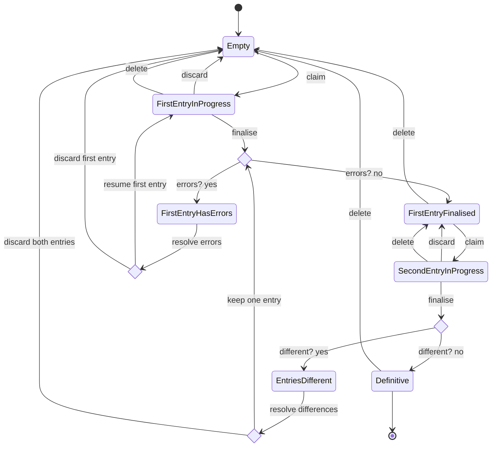

# Data entry state

This document describes the states a data entry can have.
The transition labels describe the endpoint that is used for performing the transition.
The "save" endpoint which is used for [First/Second]EntryInProgress states is kept out, because Mermaid doesn't render self-loops too well.

When resolving differences between the first and second entry (`EntriesDifferent` state), the coordinator can choose to
keep one of the entries or discard both. If one of the entries is kept, the other entry is discarded. The remaining entry
will from then on be the first entry, and the data entry is open for a new second entry.

When the coordinator decides to delete the entry when there's a second entry (`SecondEntryInProgress` &
`Definitive` state), both entries will be deleted.
