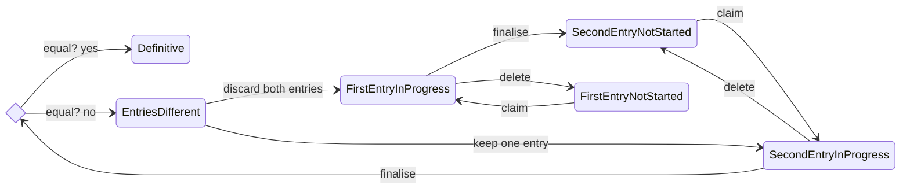

# Data entry state

This document describes the states a data entry can have.
The transition labels describe the endpoint that is used for performing the transition.
The "save" endpoint, used to for [First/Second]EntryInProgress states is kept out, because Mermaid doesn't render self-loops too well.

