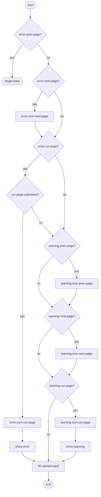
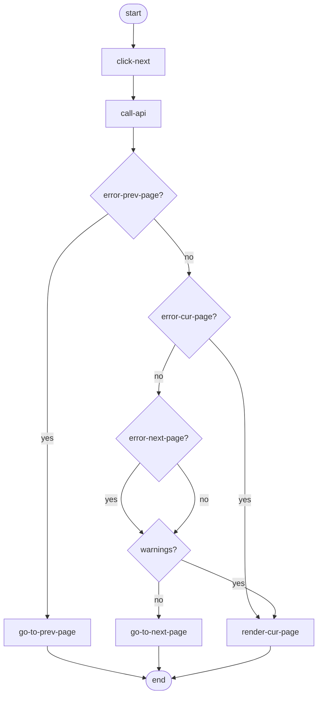
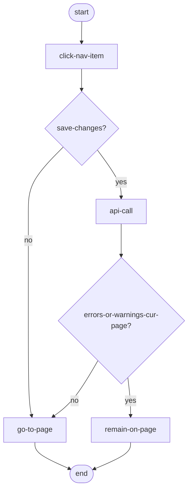

# Data Entry Navigation

## Questions
- Where does "cache input" happen in these flows?
- Is there a different warning icon for accepted versus not-accepted warnings? Or is it not possible to leave a page without accepting the warning? Also, accepting warnings is not yet included in any of the flows.

## Render page

Render happens based on last received API response.

## Click "Volgende" and call API

## Click nav item

