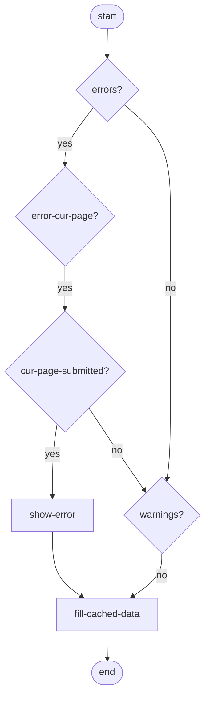
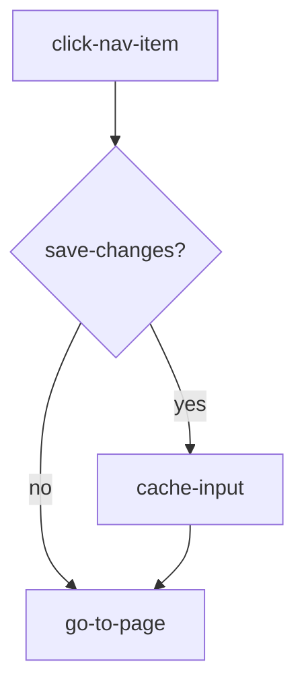

# Data Entry Navigation

## Questions
- Where does "cache input" happen in the basic happy path flow?

## Render page

Render happens based on last received API response

---

## Click "Volgende" and call API

---

## Click nav item

