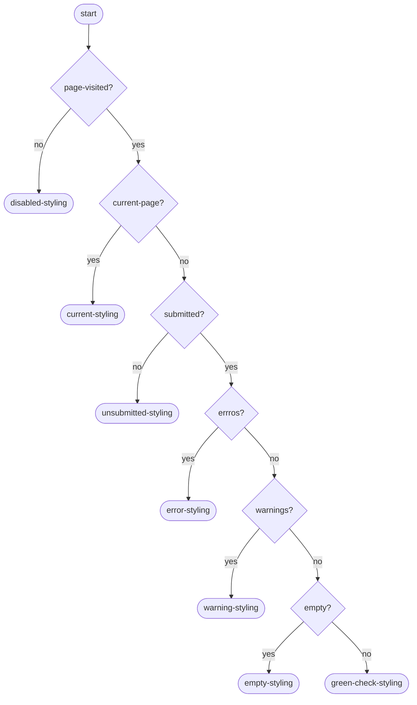
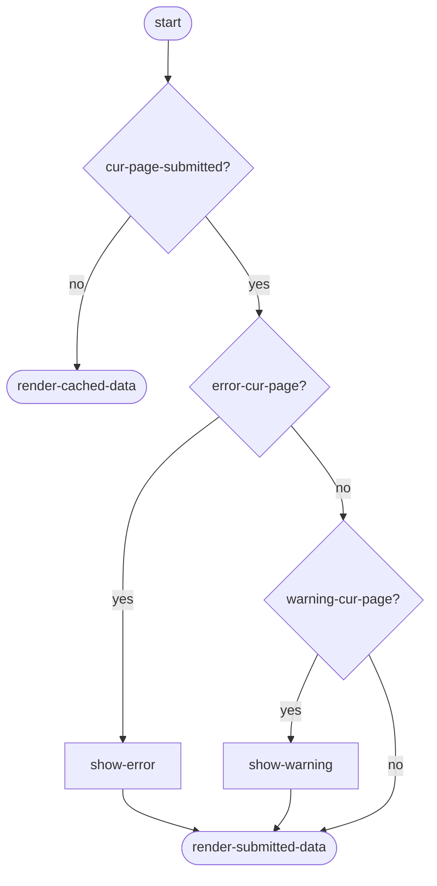
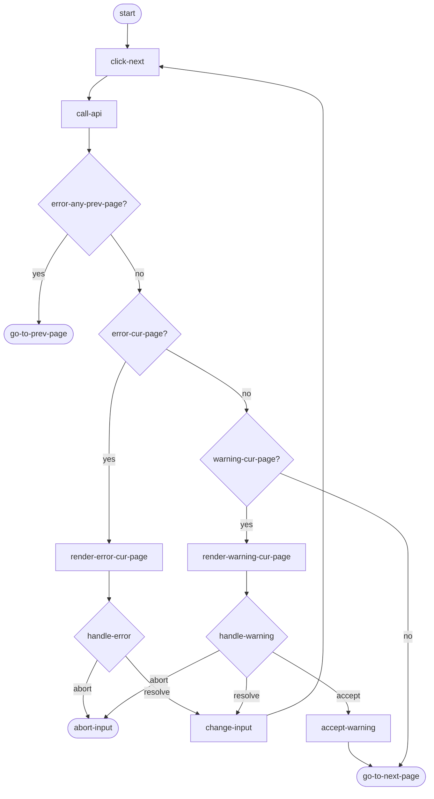
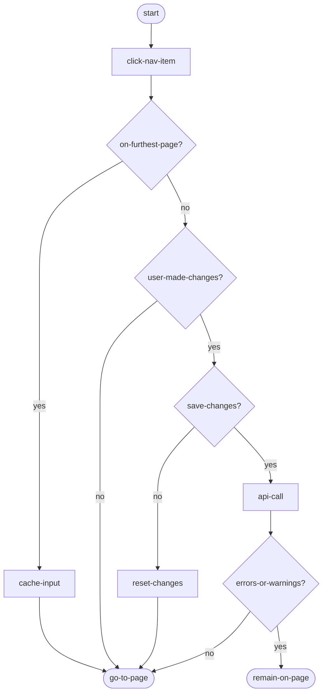

# Data Entry Page

This page describes the navigation and rendering logic of the data entry forms.

An important thing to keep in mind when reading these diagrams is that a user can only move on to the next form after resolving all errors (if any) and accepting all warnings (if any). So it should not be possible that any form previous to the current one has any errors or unaccepted warnings.

## ToDo
- update document title and file name to "data entry forms" before un-drafting the PR

## Questions
- Where does "cache input" happen in these flows?

## Render navigation menu

Render happens based on last received API response.

### Description
Evaluate these top to bottom. The first one that evaluates to true is the state of the menu item

1. index of menu-item > furthest page user has seen: `disabled` (no icon, no link)
1. index of menu-item == current: `current` (arrow icon, bold, no link)
1. index of menu-item == furthest: `unsubmitted` (blue dot)
1. page contains errors: error: `error` icon
1. page contains warnings and warnings have been accepted: `warning` (warning icon)
1. submitted data was empty `empty` (dash icon)
1. submitted data was not empty `valid` (green check icon)

### Diagram

## Render form

Render happens based on last received API response.

## Click "Volgende"

## Click nav item

