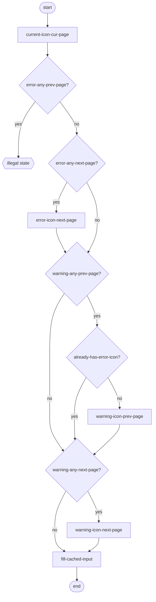
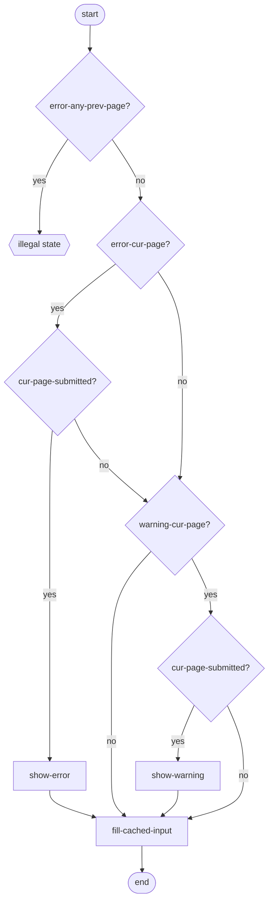
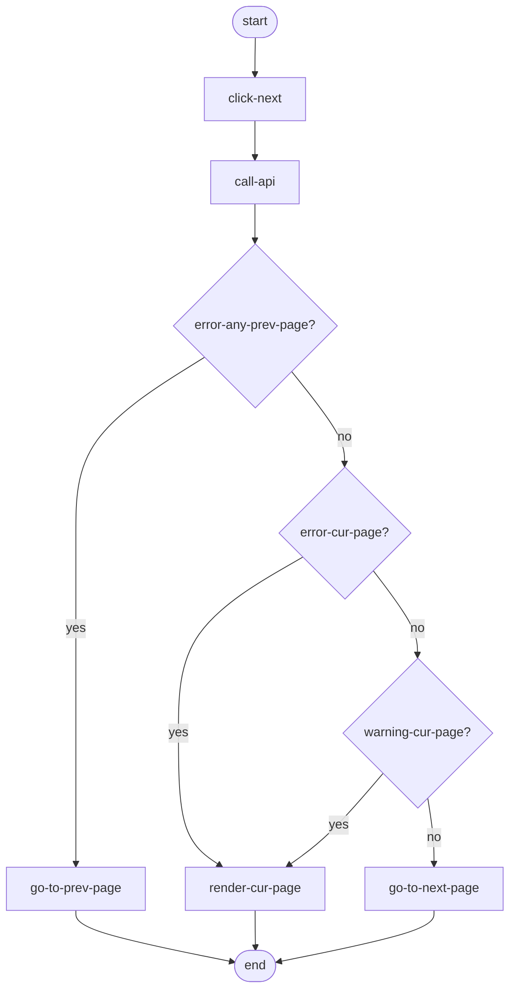
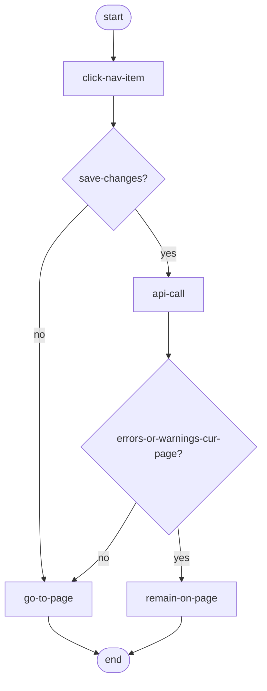

# Data Entry Page

## TODO
- add dash icon in "Render navigation menu" for forms with all fields filled with `0`
- add blue circle icon in "Render navigation menu" for forms that some field(s) filled in, but nothing submitted

## Questions
- Where does "cache input" happen in these flows?
- Is there a different warning icon for accepted versus not-accepted warnings? Or is it not possible to leave a page without accepting the warning? Also, accepting warnings is not yet included in any of the flows.

## Render navigation menu

Render happens based on last received API response.

## Render form

Render happens based on last received API response.

## Click "Volgende"

## Click nav item

