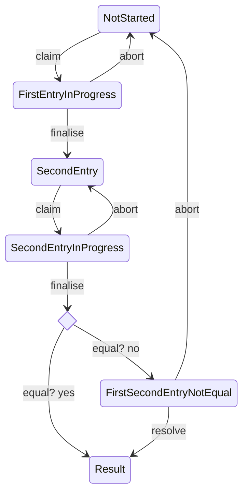

# Polling Station State

This document describes the states a polling station can have.   
The transition labels describe the endpoint that is used for performing the transition.
The "save" endpoint, used to for [First/Second]EntryInProgress states is kept out, because Mermaid doesn't render transitions to itself too well.

