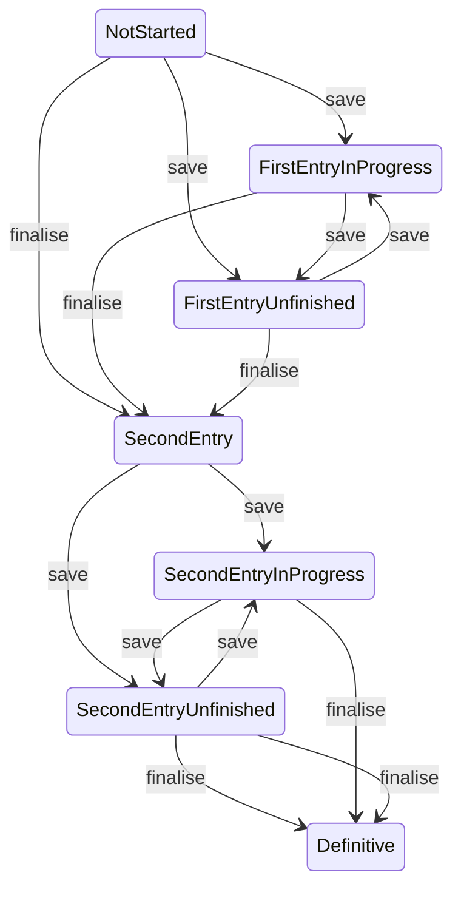

# Polling Station State

This document describes the states a polling station can have.
The transition labels describe the endpoint that is used for performing the transition.

```mermaid
stateDiagram
NotStarted --> FirstEntryInProgress: save
NotStarted --> FirstEntryUnfinished: save
NotStarted --> SecondEntry: finalise

FirstEntryInProgress --> FirstEntryUnfinished: save
FirstEntryInProgress --> SecondEntry: finalise
FirstEntryUnfinished --> FirstEntryInProgress: save
FirstEntryUnfinished --> SecondEntry: finalise

SecondEntry --> SecondEntryInProgress: save
SecondEntry --> SecondEntryUnfinished: save
SecondEntryUnfinished --> Definitive: finalise

SecondEntryInProgress --> SecondEntryUnfinished: save
SecondEntryInProgress --> Definitive: finalise
SecondEntryUnfinished --> SecondEntryInProgress: save
SecondEntryUnfinished --> Definitive: finalise
```
