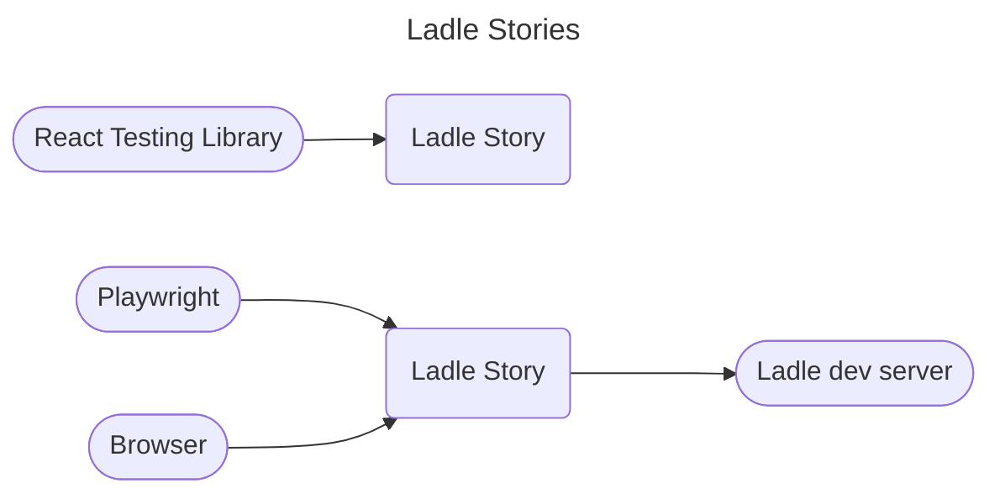
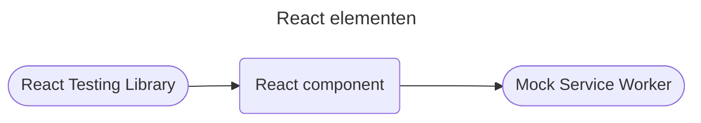
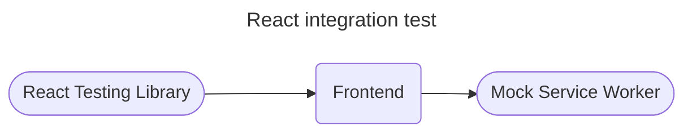
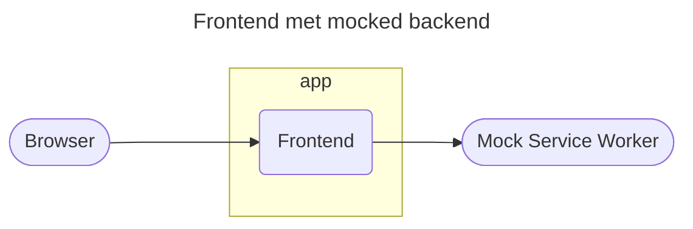
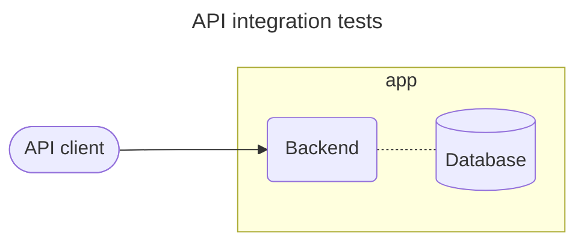
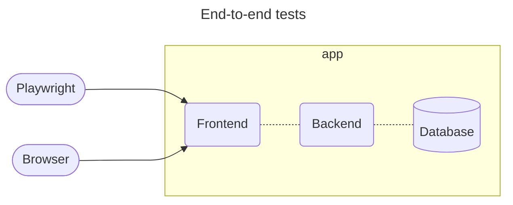

# Test-tooling

Doel van dit document is beschrijven welke tooling we voor welke tests gebruiken.

De nadruk in dit document lijkt te liggen op testautomatisering, maar zoals in ons ["Testen en kwaliteit"](./testen-en-kwaliteit.md)-document staat: *"handmatig en automatisch testen gaan samen"*.

Tests uitgevoerd door externe partijen (pen test, wettelijke toets) zijn niet opgenomen in dit document.

## Frontend

### Frontend "units"
- Container componenten: zijn verantwoordelijk voor het ophalen en weergave van data, zoals pagina's    
- Presentational componenten: zijn verantwoordelijk voor het weergeven van data
- Overige units: bijvoorbeeld API code, utility functies

### Tooling
- [eslint][eslint]: Linting
- [prettier][prettier]: Formatting 
- [Vitest][vitest]: Test runner 
- [Playwright][playwright]: Test framework inclusief runner tegen browser-engine
- [Mock Service Worker][mock-service-worker]: Mock server
- [React Testing Library][react-testing-library]: Library voor het testen van React componenten
- [Ladle][ladle]: Library voor het ontwikkelen en testen van alleenstaande componenten (alternatief voor Storybook)

### Testsoorten

Presentational componenten:
- Ladle met RTL
- Ladle met Playwright

- ... met MSW

---

---

---

## Backend
- Linting: [Rust compiler][rust-compiler] en [clippy][clippy]
- Formatting: [rustfmt][rustfmt]
- Test runner: [cargo test][cargo test]
- Unit en integratie-tests: geen additionele libraries of tools nodig
- API client: [reqwest][reqwest]

Als de performance van `cargo test` een probleem wordt, kunnen we overstappen op [cargo-nextest](https://nexte.st/index.html).

## End-to-end

Test runner: [Playwright][playwright]

## Security
- [GitHub Dependabot][github-dependabot]
- [GitHub Code Scanning][github-code-scanning]
- [GitHub Secret Scanning][github-secret-scanning]

## Performance

Nog te bepalen.

- Benchmarking opties:
    - [`cargo bench`](https://doc.rust-lang.org/nightly/unstable-book/library-features/test.html)
    - [criterion.rs](https://github.com/bheisler/criterion.rs)
    - [divan](https://github.com/nvzqz/divan)
- Load en stress testen:
    - grote data sets
    - opties voor API calls
        - [JMeter](https://jmeter.apache.org/)
        - [Locust](https://locust.io/)

## Toegankelijkheid
Nog te bepalen.

- Opties:
    - [Google Lighthouse](https://developer.chrome.com/docs/lighthouse/overview/)
    - [Axe](https://github.com/dequelabs/axe-core) (ondersteund door [Ladle][ladle])
    - [Pa11y](https://pa11y.org/)

[cargo test]: https://doc.rust-lang.org/cargo/commands/cargo-test.html
[clippy]: https://github.com/rust-lang/rust-clippy
[eslint]: https://eslint.org/
[github-code-scanning]: https://docs.github.com/en/code-security/code-scanning/introduction-to-code-scanning/about-code-scanning
[github-dependabot]: https://docs.github.com/en/code-security/dependabot/dependabot-security-updates/about-dependabot-security-updates
[github-secret-scanning]: https://docs.github.com/en/code-security/secret-scanning/introduction/about-secret-scanning
[ladle]: https://ladle.dev
[mock-service-worker]: https://mswjs.io
[playwright]: https://playwright.dev/
[prettier]: https://prettier.io/
[react-testing-library]: https://testing-library.com/docs/react-testing-library/intro
[reqwest]: https://crates.io/crates/reqwest
[rustfmt]: https://github.com/rust-lang/rustfmt
[rust-compiler]: https://rustc-dev-guide.rust-lang.org/overview.html
[vitest]: https://vitest.dev
