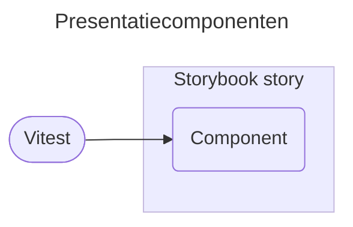
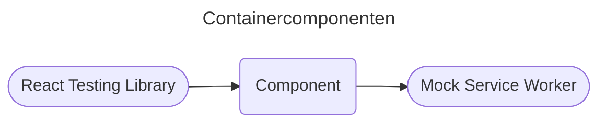
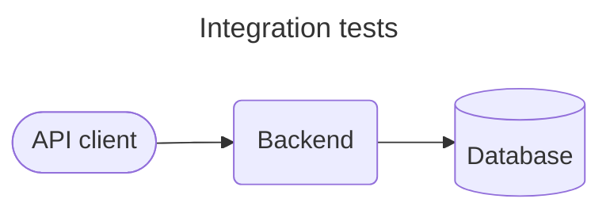
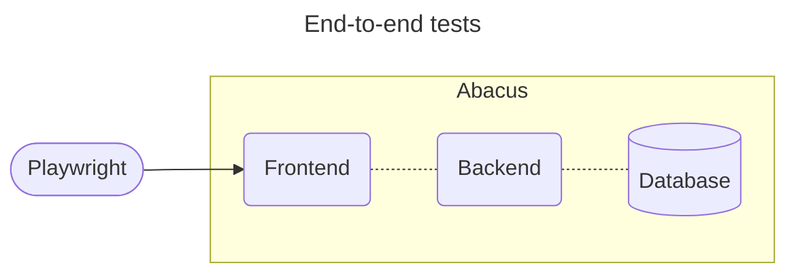

# Test-tooling

Doel van dit document is beschrijven welke tooling we voor welke tests gebruiken.

De nadruk in dit document ligt op testautomatisering, maar zoals in ons ["Testen en kwaliteit"](./testen-en-kwaliteit.md)-document staat: *"handmatig en automatisch testen gaan samen"*.

Tests uitgevoerd door externe partijen (pen test, wettelijke toets) zijn niet opgenomen in dit document.

## Frontend

### Frontend "units"
- Containercomponenten: zijn verantwoordelijk voor het ophalen en weergeven van data, zoals pagina's.
- Presentatiecomponenten: zijn verantwoordelijk voor het weergeven van data.
- Overige units: bijvoorbeeld API code, utility functies.

### Tooling
- [ESLint][eslint]: Linting
- [Biome][biome]: Formatting 
- [Vitest][vitest]: Test runner voor alle tests behalve Playwright-tests
- [Playwright][playwright]: Test framework inclusief runner tegen browser-engine
- [Mock Service Worker][mock-service-worker]: Mock server
- [React Testing Library][react-testing-library]: Library voor het testen van React componenten
- [Storybook][storybook]: Library voor het ontwikkelen en testen van alleenstaande componenten

### Tests voor presentatiecomponenten

Omdat presentatiecomponenten puur de data weergeven die ze krijgen, kunnen ze met Storybook getest worden. Ze hebben geen backend of mock server nodig.

We gebruiken hiervoor de [Storybook interaction tests](https://storybook.js.org/docs/writing-tests/interaction-testing).

---

### Tests voor containercomponenten

Containercomponenten hebben interacties met de backend voor hun data. Ze hebben dus de backend of een mock server nodig.

## Backend
- Linting: [Rust compiler][rust-compiler] en [clippy][clippy]
- Formatting: [rustfmt][rustfmt]
- Test runner: [cargo test][cargo test]
- Unit en integratie-tests: geen additionele libraries of tools nodig
- API client: [reqwest][reqwest]

Als de performance van `cargo test` een probleem wordt, kunnen we overstappen op [cargo-nextest](https://nexte.st/index.html).

### Unittests

Unit tests dekken de functionaliteit af van een enkele module. Unit tests mogen de database en API calls gebruiken.

Zodra een unit test meerdere modules beslaat of meerdere API calls in de test zelf doet, moet het een integratietest worden. (Een unit test kan API calls gebruiken voor setup/teardown naast de API call in de test zelf.)

### Integratietests

Integratietests beslaan meerdere modules en/of doen meerdere API calls in de test zelf. Ze roepen de backend-code alleen aan via de API. Ze gebruiken json voor de requests, nooit de structs.

## End-to-end

Test runner: [Playwright][playwright]

## Security
- [GitHub Dependabot][github-dependabot]
- [GitHub Code Scanning][github-code-scanning]
- [GitHub Secret Scanning][github-secret-scanning]

## Performance

Nog te bepalen.

- Benchmarking opties:
    - [`cargo bench`](https://doc.rust-lang.org/nightly/unstable-book/library-features/test.html)
    - [criterion.rs](https://github.com/bheisler/criterion.rs)
    - [divan](https://github.com/nvzqz/divan)
- Load en stress testen:
    - grote data sets
    - opties voor API calls
        - [JMeter](https://jmeter.apache.org/)
        - [Locust](https://locust.io/)

## Toegankelijkheid
Nog te bepalen.

- Opties:
    - [Google Lighthouse](https://developer.chrome.com/docs/lighthouse/overview/)
    - [Axe](https://github.com/dequelabs/axe-core)
    - [Pa11y](https://pa11y.org/)
    - [Storybook accessibility tests](https://storybook.js.org/docs/writing-tests/accessibility-testing)

[cargo test]: https://doc.rust-lang.org/cargo/commands/cargo-test.html
[clippy]: https://github.com/rust-lang/rust-clippy
[eslint]: https://eslint.org/
[github-code-scanning]: https://docs.github.com/en/code-security/code-scanning/introduction-to-code-scanning/about-code-scanning
[github-dependabot]: https://docs.github.com/en/code-security/dependabot/dependabot-security-updates/about-dependabot-security-updates
[github-secret-scanning]: https://docs.github.com/en/code-security/secret-scanning/introduction/about-secret-scanning
[mock-service-worker]: https://mswjs.io
[playwright]: https://playwright.dev/
[biome]: https://biomejs.dev/
[react-testing-library]: https://testing-library.com/docs/react-testing-library/intro
[reqwest]: https://crates.io/crates/reqwest
[rustfmt]: https://github.com/rust-lang/rustfmt
[rust-compiler]: https://rustc-dev-guide.rust-lang.org/overview.html
[storybook]: https://storybook.js.org/
[vitest]: https://vitest.dev
