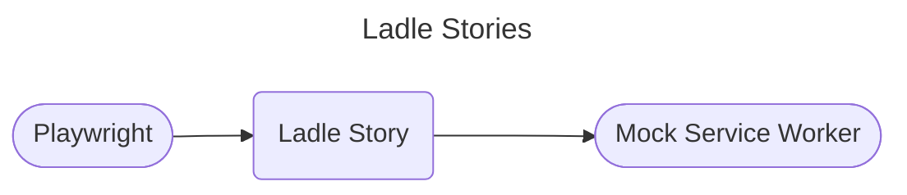
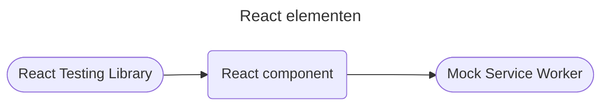
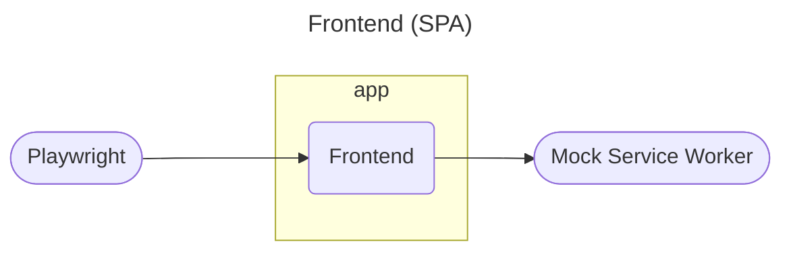
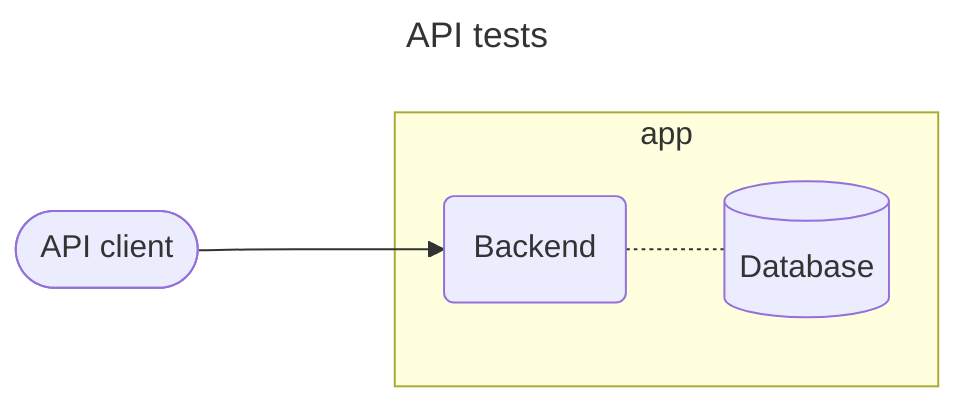
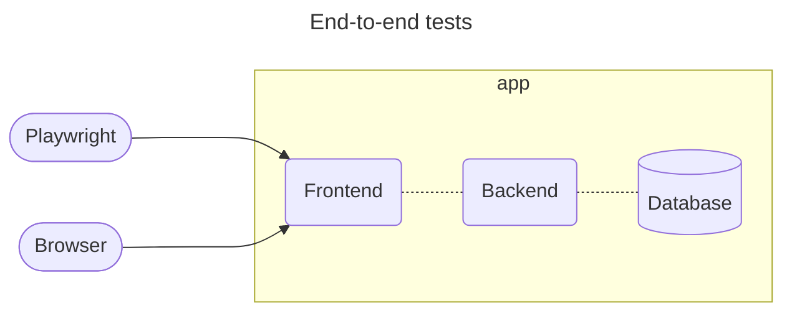

# Testsoorten en test-tooling

Doel van dit document is te beschrijven welke tests we hebben en welke tooling we ervoor gebruiken.

De nadruk in dit document lijkt te liggen op testautomatisering, maar zoals in ons ["Testen en kwaliteit"](./testen-en-kwaliteit.rst)-document staat: *handmatig en automatisch testen gaan samen ("contemporary exploratory testing")*.

Ideaal gezien draaien alle testsoorten in onze CI/CD pipeline. Belangrijkste om als eerste in de pipeline op te nemen zijn de kleinere functionele testsoorten. Deze geven de snelste en meest specifieke feedback.

Tests uitgevoerd door externe partijen (pen test, wettelijke toets) zijn niet opgenomen in dit document.

## Frontend
- Linting: [eslint](https://eslint.org/)
- Formatting: [prettier](https://prettier.io/)
- Test runner: [Vitest](https://vitest.dev/)
    - sneller dan [Jest](https://jestjs.io/)
    - compatibel met de overige tools en libraries
    - zelfde configuratie als dev (Vite)
    - [test context](https://vitest.dev/guide/test-context.html) voor setup en teardown
- Mock server: [Mock Service Worker](https://mswjs.io)
- React componenten (stories): [Ladle](https://ladle.dev) en [Playwright](https://playwright.dev/)
- React elementen: [React Testing Library](https://testing-library.com/docs/react-testing-library/intro)
- Frontend (SPA): [Playwright](https://playwright.dev/)

---

---

## Backend
- linting: Rust compiler en [clippy](https://github.com/rust-lang/rust-clippy)
- formatting: [rustfmt](https://github.com/rust-lang/rustfmt)
- test runner: [cargo test](https://doc.rust-lang.org/cargo/commands/cargo-test.html)
    - Als performance een factor wordt: [cargo-nextest](https://nexte.st/index.html).
- unit en integratietests: geen additionele libraries of tools nodig
- API clients: [ureq](https://crates.io/crates/ureq) of [reqwest](https://crates.io/crates/reqwest)

## End-to-end

test runner: [Playwright](https://playwright.dev/)

## Security
- GitHub Dependabot
- GitHub Code Scanning (publieke repo's of GitHub Advanced Security)
- GitHub Secret Scanning (publieke repo's of GitHub Advanced Security)

## Performance
- benchmarking opties:
    - [`cargo bench`](https://doc.rust-lang.org/nightly/unstable-book/library-features/test.html)
    - [criterion.rs](https://github.com/bheisler/criterion.rs)
    - [divan](https://github.com/nvzqz/divan)
- grote data sets
- veel requests opties:
    - [JMeter](https://jmeter.apache.org/)
    - [Locust](https://locust.io/)

## Toegankelijkheid
Opties:
- [Google Lighthouse](https://developer.chrome.com/docs/lighthouse/overview/)
- [Axe](https://github.com/dequelabs/axe-core)
    - ondersteund door Ladle
- [Pa11y](https://pa11y.org/)
