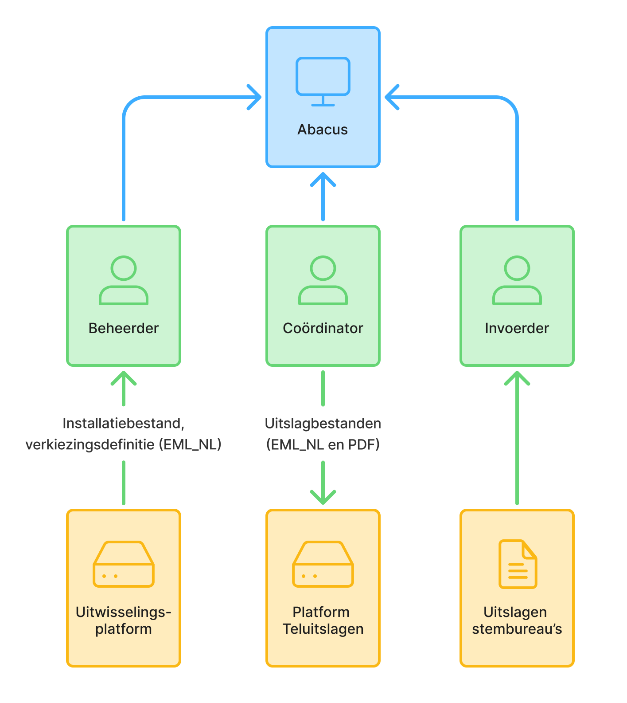
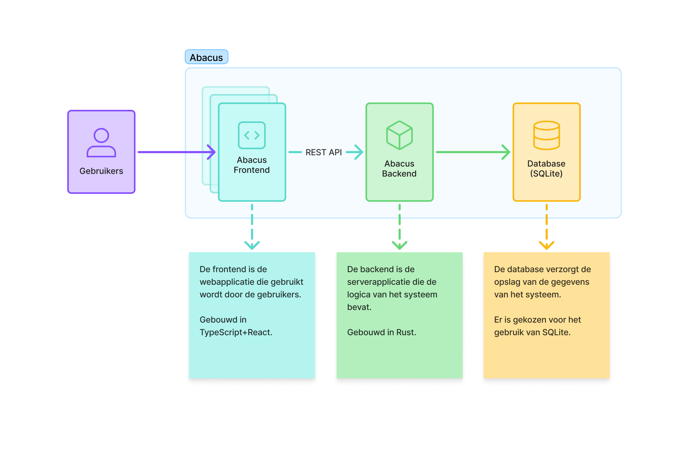
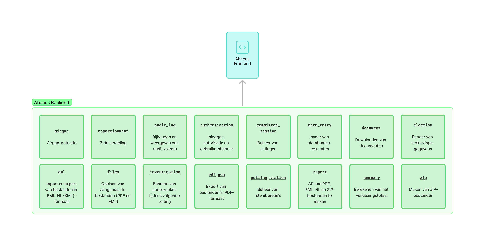
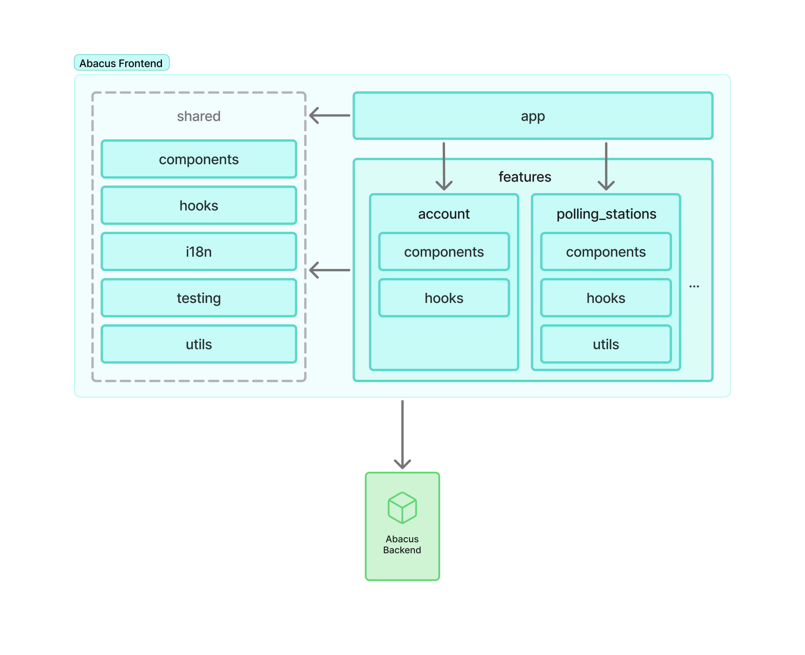

# Overzicht van de softwarearchitectuur

De visualisatie van de softwarearchitectuur volgt het [C4-model] en bestaat uit
diagrammen in vier niveaus: systeemcontext, containers, componenten en code.

Ieder niveau gaat dieper in op de details van het vorige niveau. Daarnaast is er
nog de mogelijkheid om het landschap om het systeem heen te visualiseren met een
systeemlandschapsdiagram.

Voor Abacus wordt het codediagram op dit moment niet uitgewerkt. De focus ligt
op het systeemlandschap (dit omvat ook de systeemcontext), het containerdiagram
en het componentendiagram.

[C4-model]: https://c4model.com/ "C4 model"

## Systeemlandschap

Het systeemlandschap geeft een overzicht van de systemen die in de omgeving van
het systeem bestaan. Dit diagram is bedoeld om de context van het systeem te
verduidelijken. Het omvat ook het systeemcontextdiagram.

- Abacus is het systeem ter ondersteuning van de uitslagvaststelling van
  verkiezingen.
- De gebruikers zijn onderverdeeld in de verschillende rollen die worden
  ondersteund door het systeem: beheerder, coördinator en invoerder.
- Het Uitwisselingsplatform en Platform Teluitslagen zijn bestaande systemen die
  gebruikt worden om gegevens uit te wisselen met Abacus.
- De uitslagen van de stembureaus zijn papieren documenten.

## Onderdelen

Het containerdiagram geeft een overzicht van de onderdelen van het systeem en de
bijbehorende high-level technologiekeuzes. In dit diagram is het Abacus-systeem
verder uitgesplitst in verschillende containers (frontend, backend, en
database).

- De frontend is de webapplicatie die gebruikt wordt door de gebruikers.
- De backend is de serverapplicatie die de logica van het systeem bevat.
- De database verzorgt de opslag van de gegevens van het systeem.

## Componenten

Het componentendiagram geeft een overzicht van de interne structuur van de
frontend en backend. Deze componenten zijn de belangrijkste bouwblokken van de
frontend en backend.

## Componenten backend

Deze componenten zijn in de backend geïmplementeerd als verschillende modules in
de Rust-codebase.

## Componenten frontend

De frontend volgt de [projectstructuur van Bulletproof
React][bulletproof-react-structure].

[bulletproof-react-structure]:
    https://github.com/alan2207/bulletproof-react/blob/master/docs/project-structure.md
    "Bulletproof React projectstructuur"
