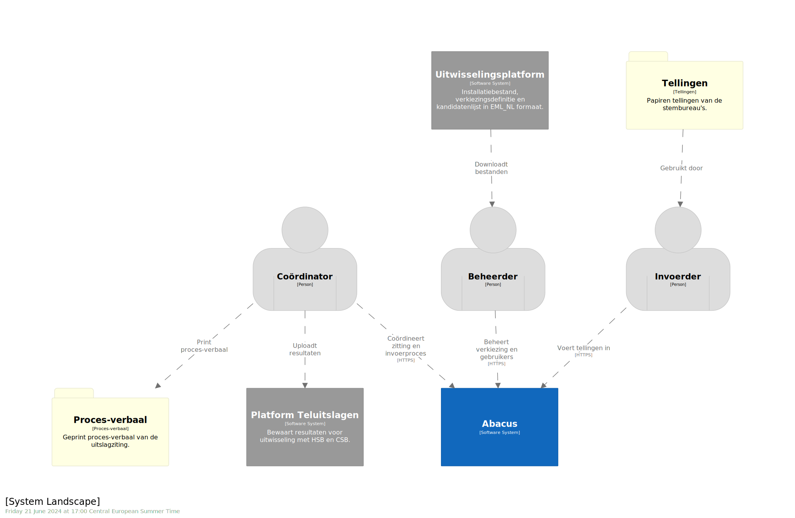
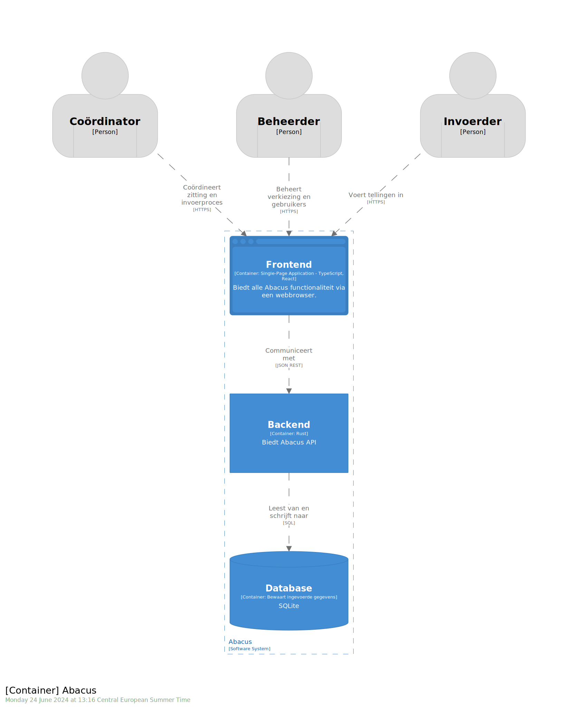
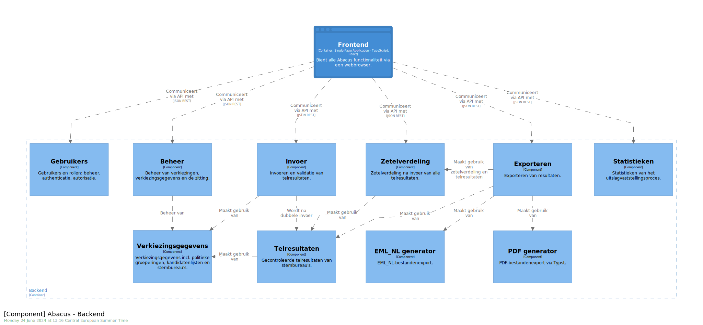

# Overzicht van de softwarearchitectuur

De visualisatie van de softwarearchitectuur volgt het [C4-model] en bestaat uit
diagrammen in vier niveau's:
1. Systeemcontext
2. Containers
3. Componenten
4. Code

Ieder niveau gaat dieper in op de details van het vorige niveau. Daarnaast is
er nog de mogelijkheid om het landschap om het systeem heen te visualiseren met
een systeemlandschapsdiagram.

Voor Abacus wordt het codediagram op dit moment niet uitgewerkt. De focus ligt
op het systeemlandschap (dit omvat ook de systeemcontext), het containerdiagram
en het componentendiagram.

[C4-model]: https://c4model.com/ "C4 model"

## Systeemlandschap

Het systeemlandschap geeft een overzicht van de systemen die in de omgeving van
het systeem bestaan. Dit diagram is bedoeld om de context van het systeem te
verduidelijken. Het omvat ook het systeemcontextdiagram.

- Abacus is het systeem ter ondersteuning van de uitslagvaststelling van
  verkiezingen.
- De gebruikers zijn onderverdeeld in de verschillende rollen die worden
  ondersteund door het systeem: beheerder, coördinator en invoerder.
- Het Uitwisselingsplatform en Platform Teluitslagen zijn bestaande systemen
  die gebruikt worden om gegevens uit te wisselen met Abacus.
- De tellingen en het proces-verbaal met de uitslag zijn papieren documenten.

## Containerdiagram

Het containerdiagram geeft een overzicht van de high-level technologiekeuzes
van het systeem. In dit diagram is het Abacus-systeem verder uitgesplitst in
verschillende containers (frontend, backend, en database).

- De frontend is de webapplicatie die gebruikt wordt door de gebruikers.
- De backend is de serverapplicatie die de logica van het systeem bevat.
- De database verzorgt de opslag van de gegevens van het systeem.

## Componentendiagram

Het componentendiagram geeft een overzicht van de interne structuur van de
backend. Deze componenten zijn de belangrijkste bouwblokken van de backend. Deze
componenten zijn in de praktijk verschillende modules in de Rust-codebase.

