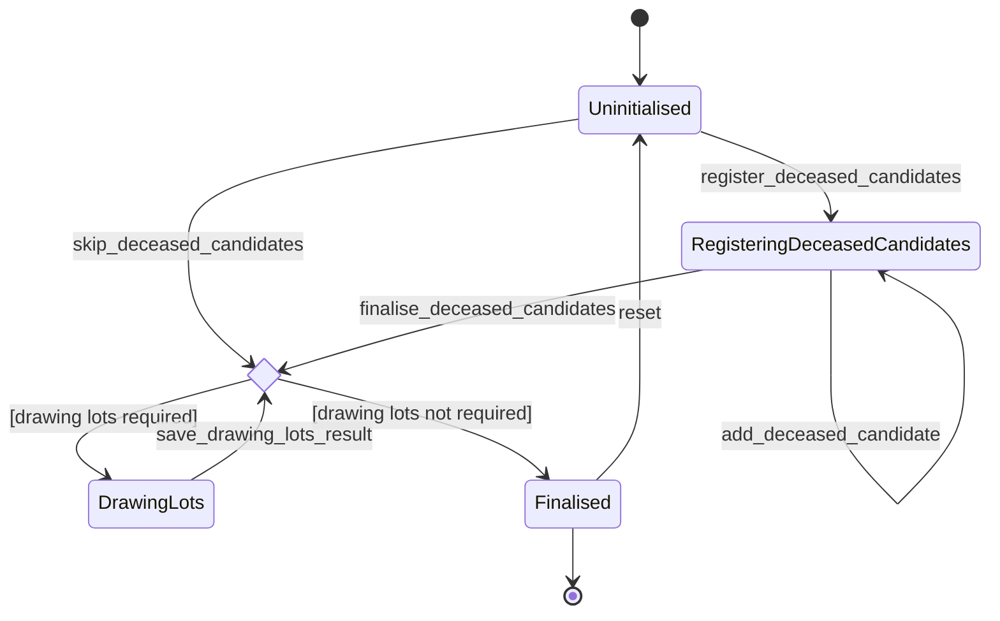

# Apportionment state

This document describes the states election apportionment can have.
The transition labels describe the action that is used for performing the transition.

```mermaid
stateDiagram-v2
  [*] --> Uninitialised

  Uninitialised --> RegisteringDeceasedCandidates : register_deceased_candidates
  RegisteringDeceasedCandidates --> RegisteringDeceasedCandidates : add_deceased_candidate

  state is_drawing_lots_required <<choice>>
  Uninitialised --> is_drawing_lots_required : skip_deceased_candidates
  RegisteringDeceasedCandidates --> is_drawing_lots_required : finalise_deceased_candidates
  is_drawing_lots_required --> DrawingLots : [drawing lots required]
  is_drawing_lots_required --> Finalised : [drawing lots not required]

  DrawingLots --> is_drawing_lots_required : save_drawing_lots_result

  Finalised --> Uninitialised : reset
  Finalised --> [*]
```
