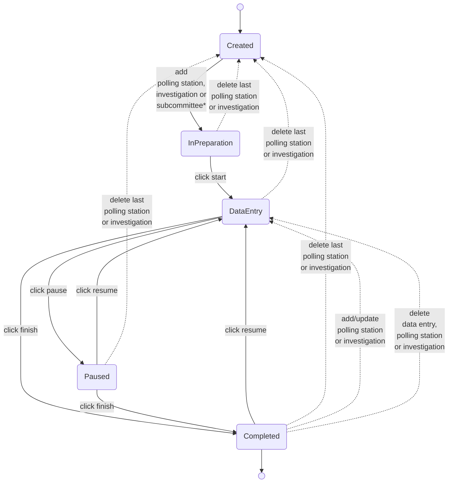

# Committee session state

This document describes the states a committee session can have.
The transition labels describe the action that is used for performing the transition.

**CSB**  
Follow the regular (uninterrupted) lines and use `subcommittee` (ignore `polling station` and `investigation`) for this flow.

> **Note:** The subcommittee is automatically created when a CSB election is created.  
> Therefore the status will move directly from `Created` to `InPreparation`.

**GSB**  
Follow the regular (uninterrupted) lines combined with the dotted lines.

In case of the first committee session, use `polling station` (ignore `investigation` and `subcommittee`) for this flow.  
For every next committee session, use `investigation` (ignore `polling station` and `subcommittee`) for this flow.

