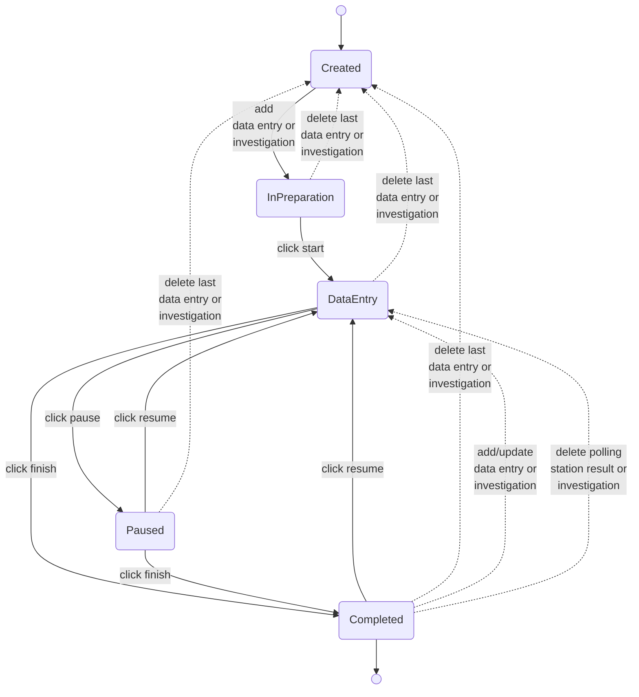

# Committee session state

This document describes the states a committee session can have.
The transition labels describe the action that is used for performing the transition.

Data entry can be linked to a polling station (GSB) or subcommittee (CSB).

**CSB**  
Follow the regular (uninterrupted) lines and use "data entry" (discard "investigation") for this flow.

**GSB**  
Follow the regular (uninterrupted) lines combined with the dotted lines.

In case of the first committee session, use "data entry" (discard "investigation") for this flow.  
For every next committee session, use "investigations" (discard "data entry") for this flow.

