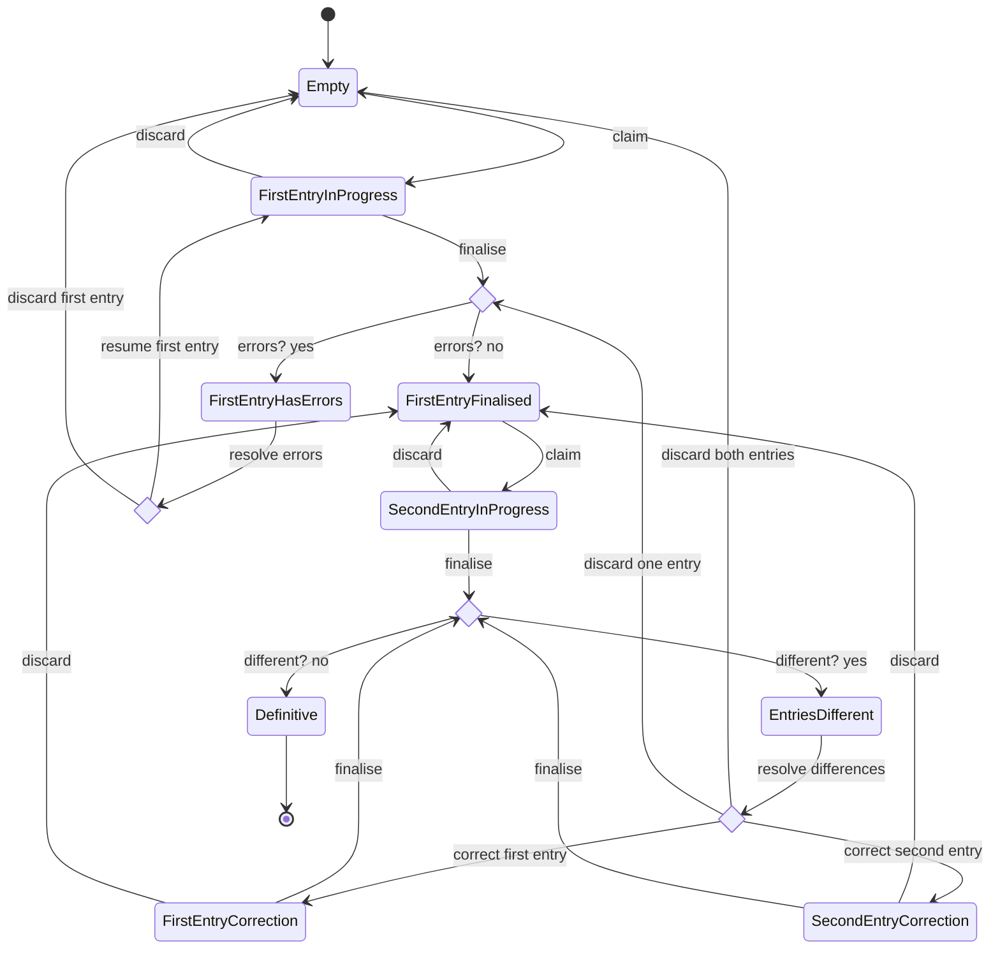

# Data entry state

This document describes the states a data entry can have.
The transition labels describe the endpoint that is used for performing the transition.

The `save` endpoint which is used for [First/Second]EntryInProgress states is kept out, because Mermaid doesn't render self-loops too well.

All states also have a `reset` endpoint which transitions to the `Empty` state, which is not shown in the diagram below. For the states `FirstEntryHasErrors` and `EntriesDifferent`, the `reset` is more explicitly called `discard first entry` resp. `discard both entries` and shown in the diagram.

Note the difference between `discard` and `reset`:
- `discard` is a typist removing their own _in-progress_ entry (the `data_entry_discard` endpoint). Discarding an in-progress second entry keeps the finalised first entry. 
- `reset` is a coordinator clearing the whole data entry back to `Empty` (the `data_entry_reset` endpoint). It always removes _both_ entries.

When resolving differences between the first and second data entry (`EntriesDifferent` state), one of the options for the coordinator is to
discard one entry. In this case, the remaining entry will from then on be the first entry, and the data entry is open for a new second entry.

