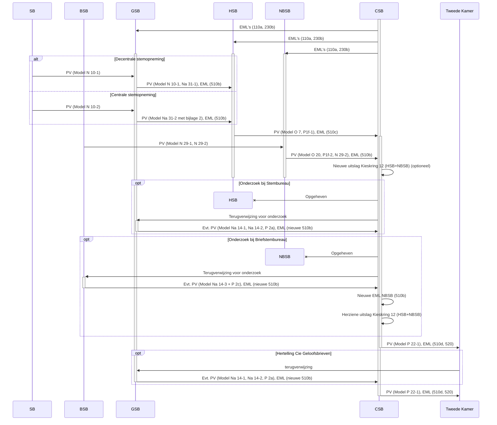
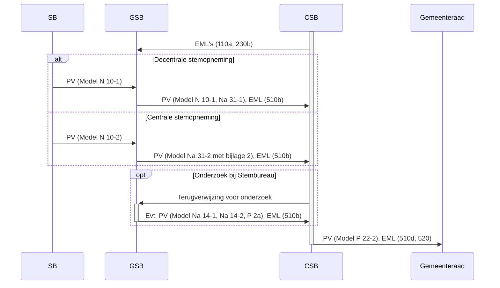
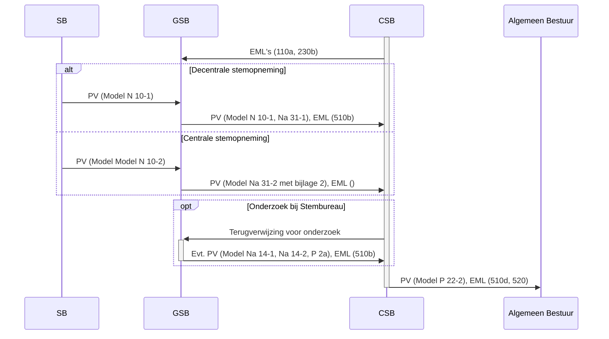
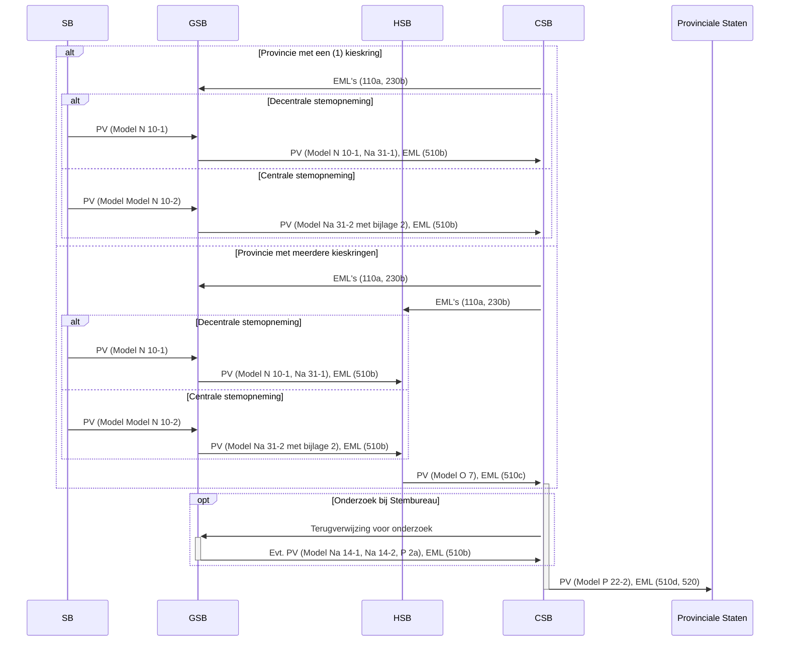
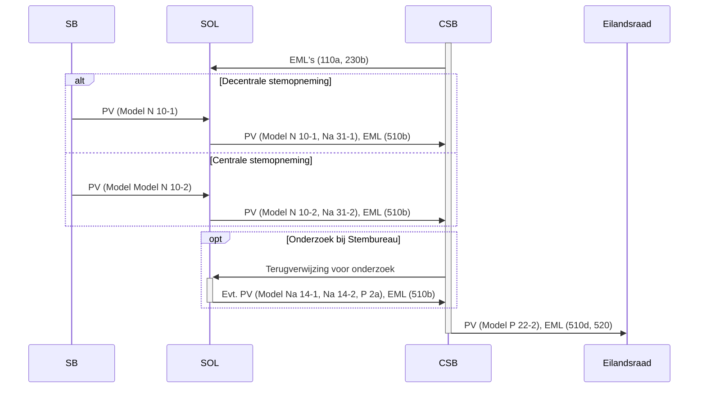

# Verloop verkiezingen

Dit document beschrijft het verloop van de verschillende verkiezingstypen. Ook bevat dit document een lijst met afkortingen, een lijst met alle modellen voor de processen-verbaal en een uitleg over de Election Markup Language (EML).

## Afkortingen

- SB: Stembureau
- BSB: Briefstembureau
- GSB: Gemeentelijk Stembureau
- SOL: Stembureau Openbaar Lichaam
- HSB: Hoofdstembureau
- NBSB: Nationaal Briefstembureau
- CSB: Centraal Stembureau
- PV: Proces-verbaal, papier met telling van stempassen en stemmen
- EML: Election Markup Language, digitale versie van PV

## Modellen voor processen-verbaal

Voor de processen-verbaal (PV's) zijn de volgende modellen beschikbaar:

- Model N 10-1: Proces-verbaal van een stembureau
- Model N 10-2: Proces-verbaal van een stembureau in een gemeente/openbaar
  lichaam waar een centrale stemopneming wordt verricht
- Model N 29-1: Proces-verbaal van de stemming bij een briefstembureau
- Model N 29-2: Proces-verbaal van de stemopneming bij een briefstembureau
- Model Na 14-1: Corrigendum bij het proces-verbaal van een stembureau
- Model Na 14-2: Corrigendum bij het proces-verbaal van een gemeentelijk
  stembureau/stembureau voor het openbaar lichaam
- Model Na 14-2 Bijlage 2: Correctie van fouten in het proces-verbaal van het
  gemeentelijk stembureau/stembureau voor het openbaar lichaam (uitkomsten per
  stembureau)
- Model Na 14-3: Corrigendum bij de processen-verbaal van een briefstembureau
- Model Na 31-1: Proces-verbaal van een gemeentelijk stembureau/stembureau voor
  het openbaar lichaam
- Model Na 31-2: Proces-verbaal van een gemeentelijk stembureau/stembureau voor
  het openbaar lichaam in een gemeente/openbaar lichaam waar een centrale
  stemopneming wordt verricht
- Model O 7: Proces-verbaal van een hoofdstembureau
- Model O 20: Proces-verbaal van het nationaal briefstembureau
- Model P 1f-1: Corrigendum bij het proces-verbaal van een hoofdstembureau
- Model P 1f-2: Corrigendum bij het proces-verbaal van het nationaal
  briefstembureau
- Model P 2a: Proces-verbaal nieuwe zitting gemeentelijk stembureau/stembureau
  voor het openbaar lichaam (in opdracht van centraal stembureau)
- Model P 2c: Proces-verbaal nieuwe zitting briefstembureau in opdracht van
  centraal stembureau
- Model P 22-1: Proces-verbaal van de uitslag van de verkiezing van de Tweede
  Kamer/het Europees Parlement/de provinciale staten

Modellen zijn vernoemd naar de desbetreffende artikelen in de [Kieswet]. De
modellen zijn te vinden op de pagina [Modellen] van de Verkiezingentoolkit.

[Kieswet]: https://wetten.overheid.nl/BWBR0004627/
[Modellen]:
    https://www.rijksoverheid.nl/onderwerpen/verkiezingen/verkiezingentoolkit/modellen

## EML

De Election Markup Language (EML) is een XML-gebaseerd formaat voor het
uitwisselen van verkiezingsresultaten (inclusief de zetelverdeling). Voor
Nederland is er de [EML_NL standaard][EML_NL], een
variant van de internationale EML-standaard die is opgesteld door de
Organization for the Advancement of Structured Information Standards (OASIS).

De EML_NL bevat de volgende schema's:

- 210 Kandidatenlijst (één per politieke groepering)
- 230b Kandidatenlijsten (één per kieskring)
- 230c Totaallijsten
- 510a Tellingbestand van stembureau (SB)
- 510b Tellingbestand van plaatselijk stembureau (PSB) = gemeente
- 510c Tellingbestand van hoofdstembureau (HSB)
- 510d Totaaltelling van centraal stembureau (CSB)
- 520 Resultaatbestand

De internationale EML-standaard is te vinden op [Election Markup Language (EML)
Version 5.0][OASIS EML 5.0]. Hiervan worden de volgende schema's gebruikt:

- [110a Verkiezingsdefinitie][110]
- [110b Lijst stembureaus][110]

[EML_NL]: https://www.kiesraad.nl/verkiezingen/osv-en-eml/eml-standaard
[OASIS EML 5.0]:
    https://docs.oasis-open.org/election/eml/v5.0/cs01/EML-Schema-Descriptions-v5.0.html
[110]:
    https://docs.oasis-open.org/election/eml/v5.0/cs01/EML-Schema-Descriptions-v5.0.html#_Toc172600906

## Verloop Tweede Kamer en Europees Parlement

Voor in ieder geval Tweede Kamer, in grote lijnen vergelijkbaar met de verkiezingen voor het Europees Parlement. Bij EP bestaan de Kieskringen formeel niet, maar de HSB's wel.

## Verloop Gemeenteraad en Eerste Kamer

Verloop van de Gemeenteraadsverkiezingen. De Eerste Kamer kent tevens stemwaardes bij het bepalen van de uitslag.

## Verloop Algemeen Bestuur Waterschap

Per Waterschap is er 1 kieskring. De verkiezing voor het AB van het Waterschap is daarmee vergelijkbaar met die voor Provinciale Staten met 1 kieskring en met de verkiezing voor de Gemeenteraad. 

## Verloop Provinciale Staten

Provincies met 1 kieskring hebben in OSV een 'csb+hsb' module, die beiden combineert. 

## Verloop Eilandsraad

